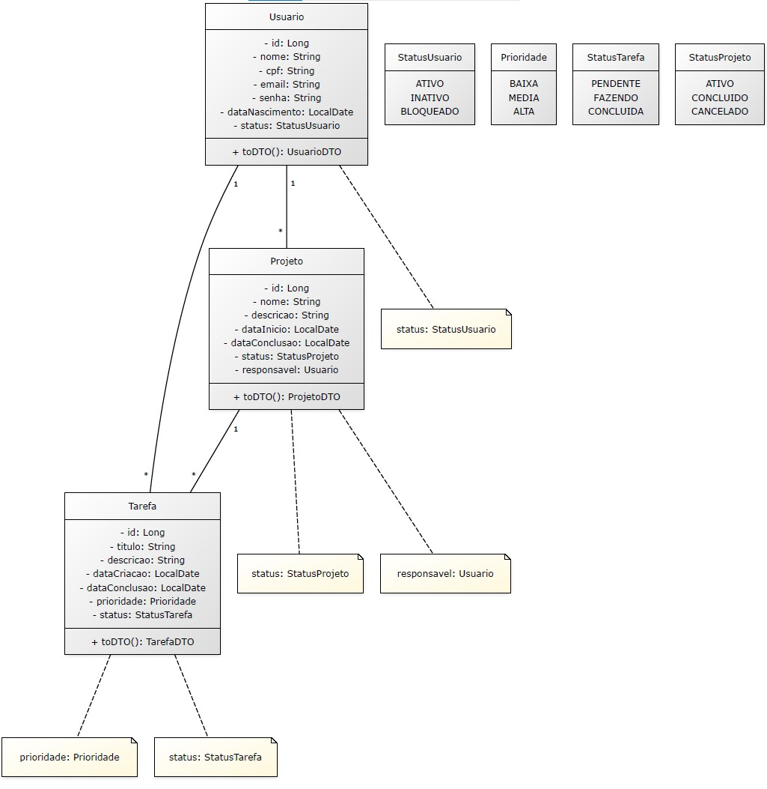

# Spring Boot - Treina Recife Turma 11

Bem-vindo ao módulo de Spring Boot da Treina Recife! Este projeto é uma aplicação de exemplo para aprender os conceitos fundamentais do framework Spring Boot.

## 📋 Descrição do Projeto

Aplicação Spring Boot com API REST para gerenciamento de usuários, utilizando:
- **Spring Boot 4.0.6**
- **Spring Data JPA** para persistência de dados
- **MySQL** como banco de dados
- **Flyway** para versionamento de banco de dados
- **Lombok** para redução de boilerplate de código

## 🛠️ Pré-requisitos

Antes de começar, certifique-se de ter instalado em sua máquina:

- **Java 17** ou superior
- **Maven 3.6+**
- **MySQL 8.0** ou superior
- **Git**
- **IDE** (recomendado: IntelliJ IDEA ou VS Code)

### Verificar Instalações

```bash
# Verificar versão do Java
java -version

# Verificar versão do Maven
mvn -version

# Verificar versão do MySQL
mysql --version
```

## 🚀 Como Configurar o Ambiente

### 1. Clonar o Repositório

```bash
git clone https://github.com/seu-repositorio/spring-boot-treina-recife-turma-11.git
cd spring-boot-treina-recife-turma-11
```

### 2. Configurar o Banco de Dados MySQL

#### 2.1 Iniciar o MySQL

Inicie o serviço MySQL em sua máquina:

**Windows (Command Prompt como Administrador):**
```bash
net start MySQL80
```

**macOS/Linux:**
```bash
brew services start mysql
```

#### 2.2 Criar o Schema do Banco de Dados

Acesse o MySQL CLI:
```bash
mysql -u root -p
```

Será solicitada a senha do MySQL. Digite a sua senha.

#### 2.3 Criar o Schema SGP2

Execute o seguinte comando no MySQL CLI:

```sql
CREATE SCHEMA sgp2 CHARACTER SET utf8mb4 COLLATE utf8mb4_unicode_ci;
```

Verifique se o schema foi criado:
```sql
SHOW SCHEMAS;
```

Saia do MySQL CLI:
```sql
EXIT;
```

### 3. Configurar as Credenciais do Banco de Dados

O arquivo de configuração da aplicação está em `src/main/resources/application.yaml`

Abra o arquivo e atualize as credenciais conforme necessário:

```yaml
spring:
  application:
    name: projeto
  datasource:
    url: jdbc:mysql://localhost/sgp2
    username: root          # ← Coloque seu usuário do MySQL
    password: admin         # ← Coloque sua senha do MySQL
  jpa:
    show-sql: true
    properties:
      hibernate:
        format_sql: true
        ddl-auto: validate
```

**⚠️ Importante:**
- `username`: Digite o usuário do seu MySQL (geralmente é `root`)
- `password`: Digite a senha que você definiu na instalação do MySQL
- Não altere a `url` (jdbc:mysql://localhost/sgp2)

### 4. Compilar e Executar a Aplicação

#### 4.1 Compilar o Projeto

```bash
mvn clean install
```

Esse comando irá:
- Limpar o diretório `target`
- Baixar as dependências
- Compilar o código
- Rodar os testes

#### 4.2 Executar a Aplicação

```bash
mvn spring-boot:run
```

Ou através da IDE (clique com botão direito em `ProjetoApplication.java` → Run).

A aplicação estará disponível em: `http://localhost:8080`

## � Modelagem do Banco de Dados (MER)

Modelo Entidade Relacionamento da aplicação:



**⚠️ Projeto em Construção:**
O projeto está em desenvolvimento. Por enquanto, apenas o módulo de **Usuários** foi implementado. As classes referentes às entidades **Projeto** e **Tarefa** estão em desenvolvimento e serão adicionadas em breve.

Entidades planejadas:
- ✅ **Usuario** - Implementada
- 🚧 **Projeto** - Em desenvolvimento
- 🚧 **Tarefa** - Em desenvolvimento

## �📁 Estrutura do Projeto

```
src/main/java/com/treinarecife/br/projeto/
├── ProjetoApplication.java           # Classe principal da aplicação
└── usuarios/                          # Módulo de Usuários
    ├── controller/
    │   └── api/
    │       └── UsuarioController.java # Endpoints da API
    ├── model/
    │   ├── Usuario.java               # Entidade de Usuário
    │   ├── dto/                       # Data Transfer Objects
    │   │   ├── UsuarioCreateDTO.java
    │   │   ├── UsuarioReadDTO.java
    │   │   └── UsuarioUpdateDTO.java
    │   └── enums/
    │       └── StatusUsuario.java
    ├── service/
    │   └── UsuarioService.java        # Lógica de negócio
    └── UsuarioRepository.java         # Acesso ao banco de dados

src/main/resources/
├── application.yaml                  # Configurações da aplicação
└── db/migration/
    └── V1__create_table_usuarios.sql # Scripts do Flyway

src/test/java/
└── ProjetoApplicationTests.java      # Testes da aplicação
```

## 🧪 Executar Testes

```bash
mvn test
```

## 🐛 Possíveis Problemas e Soluções

### Erro: "Connection refused" ou "Cannot connect to MySQL"

**Solução:**
- Verifique se o MySQL está rodando: `mysql -u root -p`
- Verifique se a senha está correta no `application.yaml`
- Verifique se o schema `sgp2` foi criado

### Erro: "Unknown database 'sgp2'"

**Solução:**
```sql
mysql -u root -p
CREATE SCHEMA sgp2 CHARACTER SET utf8mb4 COLLATE utf8mb4_unicode_ci;
EXIT;
```

### Erro: "Maven not found" ou "mvn command not found"

**Solução:**
- Instale o Maven: https://maven.apache.org/download.cgi
- Adicione o Maven ao PATH de sua máquina
- Verifique com: `mvn -version`

### Erro ao compilar: "Unsupported class-file format"

**Solução:**
- Verifique se você tem Java 17+ instalado: `java -version`
- Configure a versão do Java na IDE

## 📚 Recursos Úteis

- [Documentação Spring Boot](https://spring.io/projects/spring-boot)
- [Spring Data JPA](https://spring.io/projects/spring-data-jpa)
- [MySQL Documentation](https://dev.mysql.com/doc/)
- [Flyway Documentation](https://flywaydb.org/documentation/)
- [Lombok Project](https://projectlombok.org/

## 📝 Notas Importantes

- Nunca comita o arquivo `application.yaml` com suas credenciais reais em um repositório público
- Considere usar variáveis de ambiente para credenciais sensíveis
- Sempre teste a aplicação localmente antes de fazer push

## 💡 Próximos Passos

1. Clone o repositório
2. Configure o MySQL e crie o schema `sgp2`
3. Atualize as credenciais no `application.yaml`
4. Execute `mvn clean install`
5. Execute `mvn spring-boot:run`
6. Acesse a API em `http://localhost:8080`

---

**Dúvidas ou problemas?** Entre em contato com o instrutor ou abra uma issue no repositório.